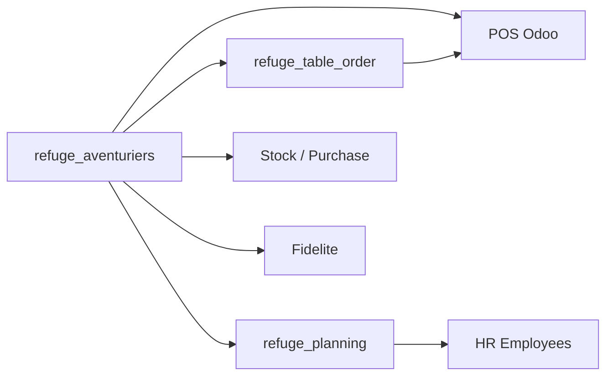
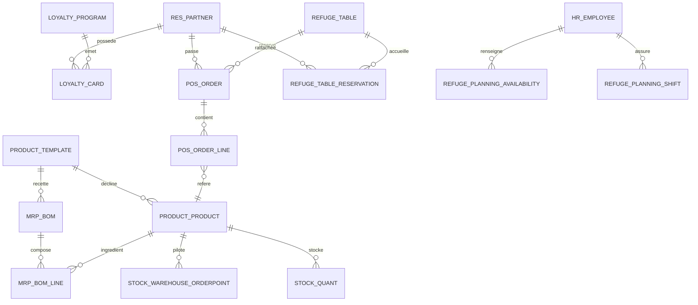
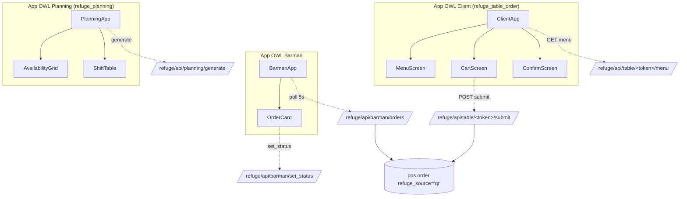

# Architecture Refuge Des Aventuriers

Ce document synthétise l'architecture fonctionnelle et technique du projet Odoo 17
pour le bar "Le Refuge des Aventuriers".

## Vue d'ensemble

Le projet repose sur trois modules custom complémentaires :

- `refuge_aventuriers` : socle métier, catalogue, employés, fournisseurs, POS, fidélité, stocks et réapprovisionnement.
- `refuge_table_order` : commande sur table en OWL, tables du bar et réservations.
- `refuge_planning` : disponibilités salariés, génération de planning et édition OWL.

## Modules Et Responsabilités

## Données Métier

Rendu PNG du diagramme (livrable 1) : [`docs/data_model.png`](./data_model.png).

## Architecture OWL (apps custom)

**Conventions** :
- État local : `useState` (pas de service global OWL).
- Communication : `refugeRpc` (JSON-RPC `type='json'`) — aucune lib tierce.
- Temps réel barman : `setInterval` 5 s nettoyé en `onWillUnmount`.
- Composants reçoivent leur état via `props`, remontent les actions via callbacks
  (`onAdd`, `onChangeQty`, `onSubmit`, `onNext`).

## Flux Principaux

### 1. Vente et fidelite

1. Les clients et points historiques sont importés par `refuge_aventuriers`.
2. Le chargeur `refuge.demo.loader` crée les cartes de fidélité et attache le programme au POS.
3. Les clients inactifs depuis plus de 6 mois voient leurs points expirés automatiquement.
4. Le POS Odoo natif affiche ensuite le solde via `pos_loyalty`.

### 2. Stock et reapprovisionnement

1. Les produits stockables reçoivent un stock initial de démonstration.
2. Des règles de réapprovisionnement `stock.warehouse.orderpoint` sont créées selon `stock_min`.
3. Les produits achetables utilisent la route d'achat du warehouse quand elle est disponible.

### 3. Commande sur table et reservations

1. `refuge.table` expose les tables avec un token QR.
2. L'app OWL client crée des commandes rattachées à `pos.order`.
3. Le back-office gère aussi des `refuge.table.reservation` de démonstration.

### 4. Planning

1. Les disponibilités hebdomadaires sont stockées dans `refuge.planning.availability`.
2. Le générateur produit des `refuge.planning.shift` en respectant les contraintes.
3. L'app OWL permet la génération, l'ajout manuel, la validation, l'annulation et la suppression.

## Données De Démonstration

Les données de démonstration sont injectées à l'installation via des appels de fonctions XML :

- `refuge.demo.loader.load_refuge_core_demo`
- `refuge.table.reservation.load_demo_reservations`
- `refuge.planning.shift.load_demo_planning`

Elles fournissent :

- des cartes fidélité et historiques d'activité,
- du stock réel sur les produits stockables,
- des règles de réapprovisionnement,
- des réservations de tables à venir,
- un planning courant avec shifts générés et shifts manuels.
